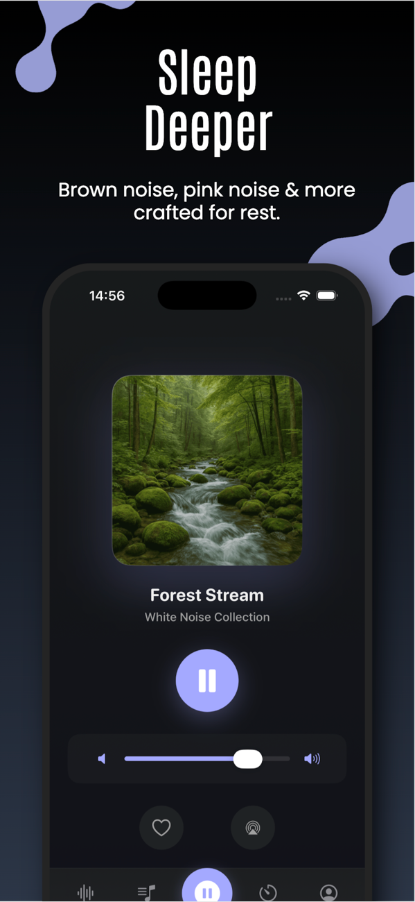
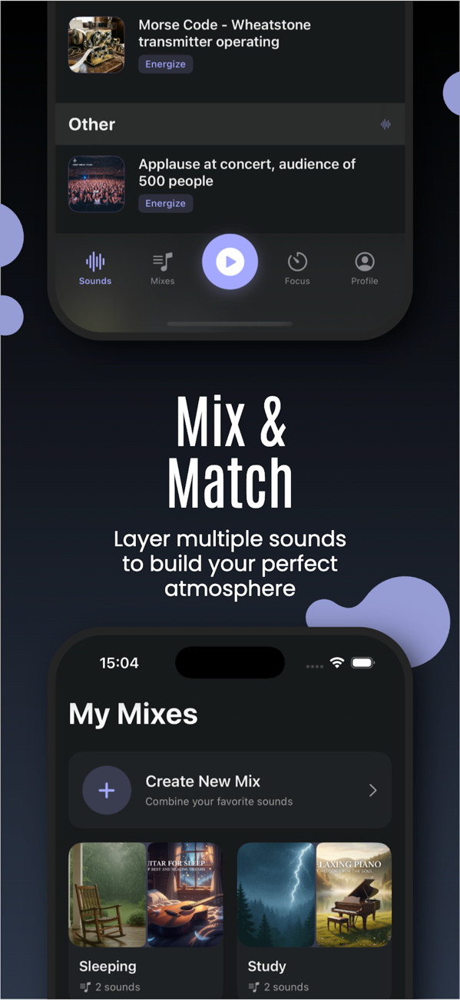
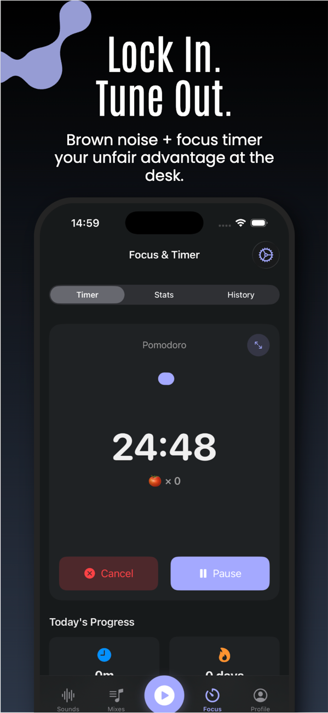

# Hi, I'm Rei

**Junior iOS developer · Philippines (UTC+8) · open to remote work**

I've shipped features on a live App Store product, working inside a senior dev's existing codebase. A lot of the work was studying his patterns, learning fast, and adapting as I went. Most of what I've built so far has been on Ambio — a small distributed team where I contribute to the monetization and lock-screen layers.

## Featured

**[Ambio](https://apps.apple.com/us/app/ambio-sleep-focus-sounds/id6749637478)** — Ambient sound app for sleep, focus, and relaxation. Live on the App Store since May 2026. Built on a small distributed team (lead engineer + marketing partner in Vietnam).

  
  
  

My layers of the app:

| Layer | What I built |
|---|---|
| **Monetization** | Google AdMob (banner, rewarded, app-open + frequency cap) and a two-tier premium-access manager built on a Combine `Publishers.CombineLatest` pipeline |
| **Lock screen** | NowPlaying + `MPRemoteCommandCenter` controls (play, pause, stop) wired on top of the app's audio playback |
| **Premium UX** | Rewarded-ad flow, unlock-expiry toast, premium sheet with iPad-aware detents, mood/tag filter chip bar |
| **Firebase** | Analytics + Crashlytics init, AdMob adapter-status logging, structured ad-lifecycle event taxonomy |

## Code you can read

| Repo | What's inside |
|---|---|
| **[AdMobKit](https://github.com/ReiKemuel/AdMobKit)** | The AdMob integration pattern from Ambio, sanitized. Banner cache, rewarded flow, app-open with a 120s cooldown, and a typed `AdLifecycleEvent` enum. Swift Package, iOS 17+. |
| **[TwoTierPremiumAccess](https://github.com/ReiKemuel/TwoTierPremiumAccess)** | The Combine pipeline that derives a single `hasPremiumAccess` flag from a rewarded-ad temporary unlock and a subscription source. Honest notes on the rough edges. Foundation + Combine only. |
| **[Morning Manna](https://github.com/ReiKemuel/morning-manna)** | The one that isn't iOS: an AI newsletter engine built with Claude Code. Turns my own church-service notes into a daily devotional email — current subscriber count: me. The engine is public; the personal content never touches git. |

## Stack

| | |
|---|---|
| **iOS** | Swift · SwiftUI · Combine · async/await · Swift Package Manager · MPNowPlayingInfoCenter · MPRemoteCommandCenter |
| **Monetization** | Google AdMob · premium-access state design |
| **Automation** | Claude Code · MCP servers (Notion, Gmail, Firecrawl) · Python tooling |

## Currently

- Growing on Ambio's monetization + platform-integration layers
- Working through the AI Automation Society challenge — each lesson ends as a reusable Claude Code skill on my machine, and I'm documenting the learning on LinkedIn
- Open to remote iOS junior roles, mentored apprenticeships, or specialized monetization / iOS-platform-API contract work
- Learning depth on Swift Concurrency design, core AVFoundation, and Django REST through code review

## Reach me

- Email: rkscordero@gmail.com
- LinkedIn: [rei-cordero-877835224](https://linkedin.com/in/rei-cordero-877835224)
- Portfolio: [reikemuel.github.io](https://reikemuel.github.io)

---

_BS Computer Science, University of the People (Jan 2026). English (professional), Filipino / Tagalog (native)._
